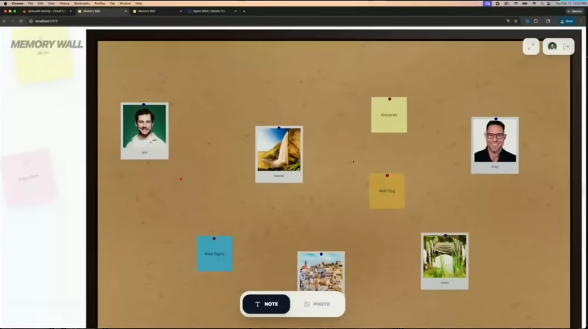

# 📌 Memory Board — 3D Interactive Cork Board

A beautiful 3D memory/cork board app built with **React**, **Three.js (React Three Fiber)**, **Zustand**, and **@react-spring/three**.



---

## ✨ Features

- 🪵 **Realistic 3D cork board** with wood frame, ambient/directional lighting, and shadows
- 📝 **Sticky notes** — add colorful notes with custom text and pin colors
- 🖼️ **Photo cards** — pin images from your device with optional captions
- 🖱️ **Drag & drop** — move any pinned item anywhere on the board
- ✏️ **Live editing** — click any item to edit text, color, caption, or pin color in a side panel
- 🗑️ **Remove items** — delete individual items or clear the whole board
- 💾 **Auto-save** — board state persists via localStorage
- 🎥 **3D camera controls** — orbit, zoom, and pan with mouse/touch
- 🌊 **Spring animations** — smooth hover and selection animations on all items

---

## 🚀 Getting Started

### Prerequisites
- Node.js **v18+** (v22 recommended)
- npm v9+

### Installation

```bash
cd memory-board
npm install
npm run dev
```

Then open [http://localhost:5173](http://localhost:5173) in your browser.

### Build for Production

```bash
npm run build
npm run preview
```

---

## 🎮 How to Use

| Action | How |
|---|---|
| **Add a note** | Click **NOTE** in the bottom toolbar |
| **Add a photo** | Click **PHOTO** → pick an image file |
| **Move an item** | Click and drag it anywhere on the board |
| **Edit a note** | Click the note → edit text in the right panel |
| **Change colors** | Click an item → pick a color in the right panel |
| **Remove an item** | Click an item → click 🗑 Remove |
| **Orbit / zoom** | Right-click + drag to orbit, scroll to zoom |
| **Pan the board** | Middle-click + drag or two-finger drag |
| **Clear all** | Click the 🗑 button in the toolbar → confirm |

---

## 🗂️ Project Structure

```
memory-board/
├── src/
│   ├── components/
│   │   ├── Scene.jsx        # Three.js Canvas, lights, camera, OrbitControls
│   │   ├── CorkBoard.jsx    # 3D cork board surface + wood frame + items
│   │   ├── PinnedNote.jsx   # 3D draggable sticky note
│   │   ├── PinnedPhoto.jsx  # 3D draggable photo card
│   │   ├── Pin.jsx          # 3D thumbtack rendered with Three.js geometry
│   │   ├── Toolbar.jsx      # Bottom UI toolbar (add note / photo)
│   │   └── ItemPanel.jsx    # Right-side editor panel for selected item
│   ├── store/
│   │   └── useBoardStore.js # Zustand global state with localStorage persist
│   ├── App.jsx              # Root component
│   ├── App.css              # All styles
│   ├── index.css            # Reset + body styles
│   └── main.jsx             # React entry point
├── index.html
├── package.json
├── vite.config.js
└── README.md
```

---

## 🛠️ Tech Stack

| Tech | Purpose |
|---|---|
| **React 18** | UI framework |
| **Three.js** | 3D rendering engine |
| **@react-three/fiber** | Declarative Three.js in React |
| **@react-three/drei** | Helpers: OrbitControls, Text, RoundedBox, useTexture, Environment |
| **@react-spring/three** | Physics-feel spring animations in 3D |
| **Zustand** | Lightweight global state management |
| **Vite** | Fast dev server and bundler |

---

## 📄 Implementation Plan

See [../Docs/implementation-plan.md](../Docs/implementation-plan.md) for the full plan.
